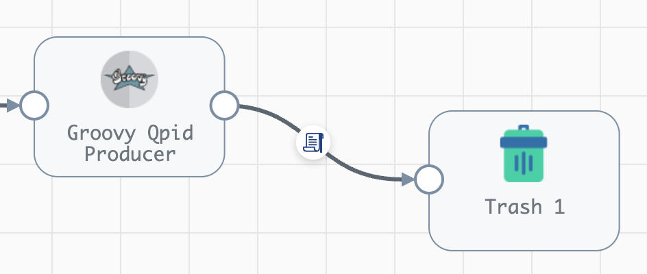

### Motivation

[Apache Qpid](https://qpid.apache.org/index.html) is an AMQP broker. Tests have been made, and Streamsets Data Collector’s (SDC) standard stages RabbitMQ and VMS are not capable of integrating with Apache Qpid. Another approach, which is discussed below, is by using Groovy evaluator. 

Java-based [VMS client](https://qpid.apache.org/components/jms/index.html) library can be integrated into SDC to read messages from Qpid queues or send messages to Qpid.

### Qpid Java VMS Client
Current SDC versions are supported for Java8 only. That makes it impossible to use the latest Qpid VMS client libraries, as from version 1.0.0 Java11 is required to build them. As an alternative, the [latest pre-1.0.0 version libraries](https://mvnrepository.com/artifact/org.apache.qpid/qpid-jms-client/0.61.0) can be used. One can either manually pick and download qpid-jms-client-0.61.0.jar and related files from MVN Repository using the link above, or use the following list:
```
https://repo1.maven.org/maven2/io/netty/netty-resolver/4.1.72.Final/netty-resolver-4.1.72.Final.jar
https://repo1.maven.org/maven2/io/netty/netty-buffer/4.1.72.Final/netty-buffer-4.1.72.Final.jar
https://repo1.maven.org/maven2/io/netty/netty-common/4.1.72.Final/netty-common-4.1.72.Final.jar
https://repo1.maven.org/maven2/io/netty/netty-handler/4.1.72.Final/netty-handler-4.1.72.Final.jar
https://repo1.maven.org/maven2/io/netty/netty-codec/4.1.72.Final/netty-codec-4.1.72.Final.jar
https://repo1.maven.org/maven2/io/netty/netty-transport/4.1.72.Final/netty-transport-4.1.72.Final.jar
https://repo1.maven.org/maven2/io/netty/netty-transport-native-epoll/4.1.72.Final/netty-transport-native-epoll-4.1.72.Final.jar
https://repo1.maven.org/maven2/io/netty/netty-transport-native-kqueue/4.1.72.Final/netty-transport-native-kqueue-4.1.72.Final.jar
https://repo1.maven.org/maven2/io/netty/netty-codec-http/4.1.72.Final/netty-codec-http-4.1.72.Final.jar
https://repo1.maven.org/maven2/org/apache/geronimo/specs/geronimo-jms_2.0_spec/1.0-alpha-2/geronimo-jms_2.0_spec-1.0-alpha-2.jar
https://repo1.maven.org/maven2/org/apache/qpid/proton-j/0.33.10/proton-j-0.33.10.jar
https://repo1.maven.org/maven2/org/slf4j/slf4j-api/1.7.32/slf4j-api-1.7.32.jar
https://repo1.maven.org/maven2/org/apache/qpid/qpid-jms-client/0.61.0/qpid-jms-client-0.61.0.jar
```
### SDC configuration
#### Libraries installation
In [SDC package manager](https://docs.streamsets.com/portal/datacollector/latest/help/datacollector/UserGuide/Installation/AddtionalStageLibs.html?hl=package%2Cmanager), install Groovy package.

Upload Qpid VMS client library JAR files onto SDC engine as [external resources](https://docs.streamsets.com/portal/platform-controlhub/controlhub/UserGuide/Deployments/ExternalResource.html#concept_ixn_mjd_z4b).
As a brief summary of the above link, here are actions to perform on SDC:
1. In $SDC_HOME/externalResources/streamsets-libs-extras directory, create a new directory streamsets-datacollector-groovy_2_4-lib, and inside the latter, create a new directory lib.
2. Copy the required JAR files into that streamsets-datacollector-groovy_2_4-lib/lib/ directory.
3. Restart SDC.

Create a Java Key Store (JKS) files for SSL Keystore and SSL Truststore in SDC filesystem or use some existing ones.
Import the server certificate into Truststore JKS, and the client certificate into Keystore JKS. Here’s an example for importing (assumes the certificate is in DER format; you need to know the JKS’ password):
```
keytool -import -alias your-alias -keystore your-keystore.jks -file certificate.der
```

The keystore files should be placed in the filesystem location available for SDC.

A quick and relatively easy option is to reuse $SDC_HOME/etc/keystore.jks file, but be mindful of security implications.

More details on Qpid client runtime configuration are provided in the documentation on [Apache website](https://qpid.apache.org/releases/qpid-jms-2.0.0/docs/index.html).

Security permissions
On SDC machine, open the file $SDC_HOME/etc/sdc-security.policy in a text editor and add the following lines. Text in <angle brackets> requires changing):
```
grant codebase "file:/groovy/script"{
permission java.util.PropertyPermission "java.naming.provider.url", "read";
permission java.util.PropertyPermission "org.apache.qpid.jms.deserialization.white_list", "read";
permission java.util.PropertyPermission "org.apache.qpid.jms.deserialization.allow_list", "read";
permission java.util.PropertyPermission "org.apache.qpid.jms.deserialization.black_list", "read";
permission java.util.PropertyPermission "org.apache.qpid.jms.deserialization.deny_list", "read";
permission java.net.SocketPermission "<qpid-server-address>", "connect,resolve";
permission java.io.FilePermission "</path/to/your/keystore.jks>", "read";
permission java.io.FilePermission "<$SDC_HOME>/externalResources/streamsets-libs-extras/streamsets-datacollector-groovy_2_4-lib/lib/netty-resolver-4.1.72.Final.jar", "read";
permission java.io.FilePermission "<$SDC_HOME>/externalResources/streamsets-libs-extras/streamsets-datacollector-groovy_2_4-lib/lib/netty-handler-4.1.72.Final.jar", "read";
permission java.io.FilePermission "<$SDC_HOME>/externalResources/streamsets-libs-extras/streamsets-datacollector-groovy_2_4-lib/lib/netty-buffer-4.1.72.Final.jar", "read";
permission java.io.FilePermission "<$SDC_HOME>/externalResources/streamsets-libs-extras/streamsets-datacollector-groovy_2_4-lib/lib/netty-common-4.1.72.Final.jar", "read";
permission java.io.FilePermission "<$SDC_HOME>/externalResources/streamsets-libs-extras/streamsets-datacollector-groovy_2_4-lib/lib/netty-handler-4.1.72.Final.jar", "read";
permission java.io.FilePermission "<$SDC_HOME>/externalResources/streamsets-libs-extras/streamsets-datacollector-groovy_2_4-lib/lib/netty-transport-4.1.72.Final.jar", "read";
permission java.io.FilePermission "<$SDC_HOME/externalResources/streamsets-libs-extras/streamsets-datacollector-groovy_2_4-lib/lib/netty-transport-native-epoll-4.1.72.Final.jar", "read";
permission java.io.FilePermission "<$SDC_HOME>/externalResources/streamsets-libs-extras/streamsets-datacollector-groovy_2_4-lib/lib/netty-transport-native-kqueue-4.1.72.Final.jar", "read";
permission java.io.FilePermission "<$SDC_HOME>/externalResources/streamsets-libs-extras/streamsets-datacollector-groovy_2_4-lib/lib/netty-codec-http-4.1.72.Final.jar", "read";
permission java.io.FilePermission "<$SDC_HOME>/externalResources/streamsets-libs-extras/streamsets-datacollector-groovy_2_4-lib/lib/geronimo-jms_2.0_spec-1.0-alpha-2.jar", "read";
permission java.io.FilePermission "<$SDC_HOME>/externalResources/streamsets-libs-extras/streamsets-datacollector-groovy_2_4-lib/lib/proton-j-0.33.10.jar", "read";
permission java.io.FilePermission "<$SDC_HOME>/externalResources/streamsets-libs-extras/streamsets-datacollector-groovy_2_4-lib/lib/slf4j-api-1.7.32.jar", "read";
permission java.io.FilePermission "<$SDC_HOME>/externalResources/streamsets-libs-extras/streamsets-datacollector-groovy_2_4-lib/lib/qpid-jms-client-0.61.0.jar", "read";
permission java.util.PropertyPermission "javax.net.ssl.keyStore", "read";
permission java.util.PropertyPermission "javax.net.ssl.keyStoreType", "read";
permission java.util.PropertyPermission "javax.net.ssl.keyStorePassword", "read";
permission java.util.PropertyPermission "javax.net.ssl.trustStore", "read";
permission java.util.PropertyPermission "javax.net.ssl.trustStoreType", "read";
permission java.util.PropertyPermission "javax.net.ssl.trustStorePassword", "read";
permission java.util.PropertyPermission "proton.transport_buffer_release_threshold", "read";
permission java.lang.RuntimePermission "getenv.PN_TRACE_FRM";
permission java.util.PropertyPermission "proton.trace_frame_payload_length", "read";
permission java.lang.RuntimePermission "modifyThread";
};
```
### Pipeline development
The code samples below don’t make precautions for securing/hiding access credentials like passwords. While the coding evaluator doesn’t allow use of credential functions, which secure credentials properly, [runtime property functions](https://docs.streamsets.com/portal/datacollector/latest/help/datacollector/UserGuide/Pipeline_Configuration/RuntimeValues.html#concept_fjx_g31_1s) can obfuscate access details and place them outside of pipelines.
####Producer
For Qpid producer, use [Groovy evaluator](https://docs.streamsets.com/portal/datacollector/latest/help/datacollector/UserGuide/Processors/Groovy.html#concept_ldh_sct_gv) processor. Most likely, it will be the last stage of a pipeline and no data processing would occur after it, so put a Trash destination after it in the pipeline layout like in the screenshot below:  


The code below assumes that data to be  sent to the AMQP destination is stored in the incoming records in the field *amqpOut*. Use Expression Evaluator or Field Renamer processors to achieve that.

In the Groovy evaluator configuration, replace the default code with the following (text in <angle brackets> will have to be changed):

